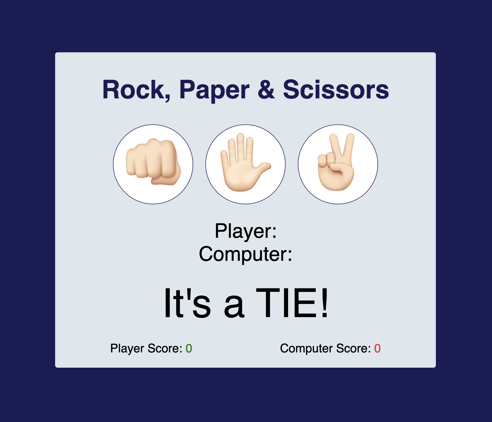

# Rock, Paper & Scissors Game

This is a simple web-based implementation of the classic game "Rock, Paper & Scissors". The game allows a player to compete against the computer through a series of rounds.

## Features

- Interactive buttons for player's choices (Rock, Paper, Scissors).
- Real-time updates of player's and computer's choices.
- Immediate display of game results (Win, Lose, Tie).
- Score tracking for both player and computer.
- Dynamic styling to indicate game outcomes (green for win, red for lose).

## Technologies Used

- HTML
- CSS
- JavaScript

## How to Play

1. Clone this repository.
2. Open `index.html` in your web browser.
3. Click on one of the three buttons (👊🏻 for Rock, ✋🏻 for Paper, ✌🏻 for Scissors) to make your choice.
4. The computer will randomly select its choice.
5. The game result will be displayed immediately, along with updated scores.
6. Play multiple rounds to compete and see who wins more!

## Preview

### Development Notes

- The game logic is handled in `script.js` which includes functions to manage player input, computer selection, and result determination.
- Styles are defined in `styles.css` to ensure a visually appealing experience.
- JavaScript dynamically updates the DOM to reflect game state changes and maintain an interactive user interface.

Feel free to enhance this project further and adapt it to your needs. Happy gaming!
